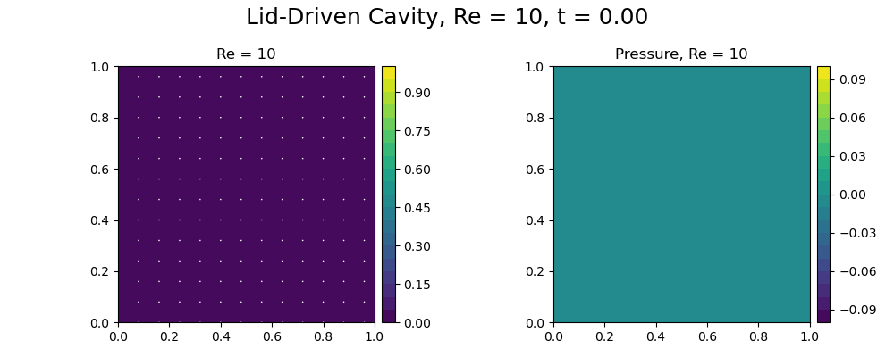
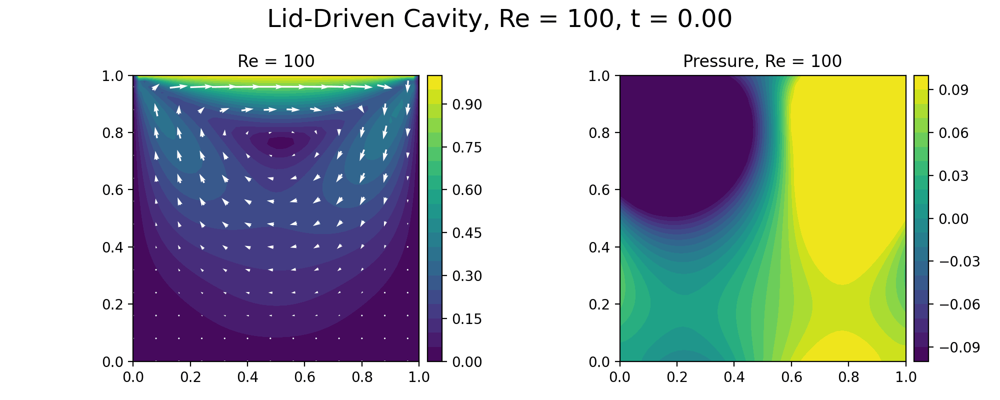
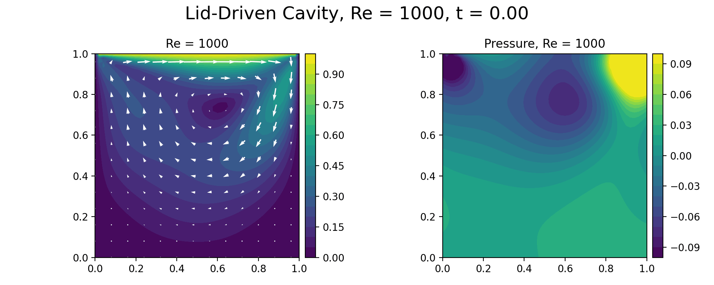
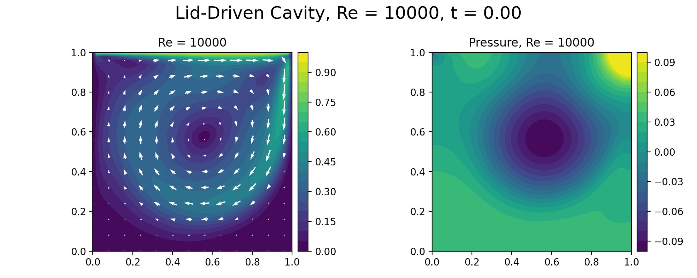

# Lid-Driven Cavity with FEniCSx

This project solves the 2D lid-driven cavity problem using the finite element. The lid-driven cavity problem is a classical fluid dynamics benchmark where fluid is trapped inside a closed box, and the flow is generated by moving the top wall (the “lid”) horizontally while the other walls are stationary. The resulting flow patterns, including vortices and recirculation zones, depend on the Reynolds number, which characterizes the relative importance of inertial forces to viscous forces.
method in FEniCSx with:

- Taylor–Hood finite elements
- UFL residual and Jacobian forms
- Dirichlet boundary conditions
- PETSc-backed Newton solvers

The workflow is designed for multiple Reynolds numbers so the generated figures
and animations reproduce the classical lid-driven cavity benchmark behavior.

---

# Files

- `solve_lid_driven_cavity.py`  
  Runs the cavity simulations for all Reynolds numbers listed in
  `cavity_solver_config.txt`.

- `cavity_boundary_conditions.py`  
  Boundary locator utilities for the moving lid and no-slip walls.

- `cavity_solution_sampling.py`  
  Sampling utilities and cache-directory helpers used by the FEM workflow.

- `cavity_case_io.py`  
  Parameter parsing and per-case output writing.

- `plot_cavity_case_fields.py`  
  Generates velocity magnitude, streamline, quiver, and pressure plots.

- `plot_cavity_ghia_comparison.py`  
  Compares the `Re=100` centerline velocity profiles against the classical
  Ghia benchmark data.

- `run_cavity_convergence.py`  
  Performs the mesh convergence study.

- `run_verification_convergence.py`  
  Solves a manufactured steady Stokes problem on a sequence of meshes and
  computes exact error norms for verification.

- `cavity_solver_config.txt`  
  Stores Reynolds numbers, mesh size, time step, solver tolerances,
  PETSc configuration, and plotting settings.

---

## Mathematical Model

The code solves the incompressible Navier–Stokes equations on the unit square:

```math
\frac{\partial \mathbf{u}}{\partial t}
+
(\mathbf{u}\cdot\nabla)\mathbf{u}
-
\nu \Delta \mathbf{u}
+
\nabla p
=
0
```

```math
\nabla \cdot \mathbf{u} = 0
```

where:

- $\mathbf{u}$ is the velocity field
- $p$ is the pressure
- $\nu$ is the kinematic viscosity

---

# Boundary Conditions

The lid-driven cavity boundary conditions are:

## Moving lid (top wall)

$$
\mathbf{u} = (1,0)
$$

## Stationary walls

$$
\mathbf{u} = (0,0)
$$

applied on the left, right, and bottom boundaries.

Because the incompressible Navier–Stokes equations determine pressure only up to
a constant, one pressure degree of freedom is pinned at the origin to remove
the null space.

---

# Finite Element Discretization

The solver uses:

- Unit-square triangular mesh
- Quadratic Lagrange elements (`P2`) for velocity
- Linear Lagrange elements (`P1`) for pressure

This corresponds to the classical Taylor–Hood mixed finite element pair.

The time discretization uses the backward Euler method, while the nonlinear
convective term is solved using Newton iterations.

---

# Weak Formulation of the Incompressible Navier–Stokes Equations

## Strong Form

The incompressible Navier–Stokes equations on the domain $\Omega$ are:

### Momentum equation

$$
\frac{\partial \mathbf{u}}{\partial t}
+ (\mathbf{u}\cdot\nabla)\mathbf{u}
- \nu \Delta \mathbf{u}
+ \nabla p
= 0
\qquad \text{in } \Omega
$$

### Continuity equation

$$
\nabla \cdot \mathbf{u}
= 0
\qquad \text{in } \Omega
$$

where:

- $\mathbf{u} = (u_x,u_y)$ is the velocity field,
- $p$ is the pressure field,
- $\nu$ is the kinematic viscosity.

---

# Boundary Conditions

## Moving lid

$$
\mathbf{u} = (1,0)
\qquad \text{on } y=1
$$

## No-slip walls

$$
\mathbf{u} = (0,0)
\qquad \text{on } x=0,\ x=1,\ y=0
$$

---

# Time Discretization

Using the backward Euler method:

$$
\frac{\partial \mathbf{u}}{\partial t}
\approx
\frac{\mathbf{u}^{n+1}-\mathbf{u}^{n}}{\Delta t}
$$

Substituting into the momentum equation gives:

$$
\frac{\mathbf{u}^{n+1}-\mathbf{u}^{n}}{\Delta t}
+
(\mathbf{u}^{n+1}\cdot\nabla)\mathbf{u}^{n+1}
-
\nu \Delta \mathbf{u}^{n+1}
+
\nabla p^{n+1}
=
0
$$

Define

$$
\mathbf{u} = \mathbf{u}^{n+1},
\qquad
\mathbf{u}_n = \mathbf{u}^{n}
$$

Then the semi-discrete equation becomes:

$$
\frac{\mathbf{u}-\mathbf{u}_n}{\Delta t}
+
(\mathbf{u}\cdot\nabla)\mathbf{u}
-
\nu \Delta \mathbf{u}
+
\nabla p
=
0
$$

---

# Weak Form Derivation

Introduce:

- velocity test function $\mathbf{v}$,
- pressure test function $q$.

Multiply the momentum equation by $\mathbf{v}$ and integrate over the domain:

$$
\int_{\Omega}
\frac{\mathbf{u}-\mathbf{u}_n}{\Delta t}
\cdot \mathbf{v}
\ d\Omega
$$

$$
+
\int_{\Omega}
((\mathbf{u}\cdot\nabla)\mathbf{u})
\cdot \mathbf{v}
\ d\Omega
$$

$$
-
\nu
\int_{\Omega}
(\Delta \mathbf{u})
\cdot \mathbf{v}
\ d\Omega
$$

$$
+
\int_{\Omega}
(\nabla p)\cdot \mathbf{v}
\ d\Omega
=
0
$$

---

# Integration by Parts of the Diffusion Term

The viscous term is

$$
-\nu
\int_{\Omega}
(\Delta \mathbf{u})
\cdot \mathbf{v}
\ d\Omega
$$

Applying integration by parts:

$$
-\int_{\Omega}
(\Delta \mathbf{u})
\cdot \mathbf{v}
\ d\Omega
=
\int_{\Omega}
\nabla \mathbf{u}
:
\nabla \mathbf{v}
\ d\Omega
-
\int_{\partial\Omega}
\frac{\partial \mathbf{u}}{\partial n}
\cdot \mathbf{v}
\ dS
$$

Since Dirichlet boundary conditions are imposed strongly, the boundary integral vanishes.

Thus the viscous contribution becomes:

$$
\nu
\int_{\Omega}
\nabla \mathbf{u}
:
\nabla \mathbf{v}
\ d\Omega
$$

---

# Pressure Term

The pressure gradient term is:

$$
\int_{\Omega}
(\nabla p)\cdot \mathbf{v}
\ d\Omega
$$

Applying integration by parts gives:

$$
\int_{\Omega}
(\nabla p)\cdot \mathbf{v}
\ d\Omega
=
-
\int_{\Omega}
p(\nabla\cdot\mathbf{v})
\ d\Omega
+
\int_{\partial\Omega}
p\mathbf{v}\cdot\mathbf{n}
\ dS
$$

Again the boundary term vanishes, leaving:

$$
-
\int_{\Omega}
p(\nabla\cdot\mathbf{v})
\ d\Omega
$$

---

# Continuity Equation

Multiply incompressibility by the pressure test function $q$:

$$
\int_{\Omega}
q(\nabla\cdot\mathbf{u})
\ d\Omega
=
0
$$

---

# Pressure Stabilization

The implementation also adds a small stabilization term:

$$
\epsilon
\int_{\Omega}
pq
\ d\Omega
$$

where

$$
\epsilon \ll 1
$$

---

# Final Weak Form

Find

$$
(\mathbf{u},p)
\in
V \times Q
$$

such that for all

$$
(\mathbf{v},q)
\in
V \times Q
$$

the following equation holds:

$$
F(\mathbf{u},p;\mathbf{v},q)=0
$$

with

$$
F(\mathbf{u},p;\mathbf{v},q)
=
\frac{1}{\Delta t}
(\mathbf{u}-\mathbf{u}_n,\mathbf{v})
+
\nu
(\nabla\mathbf{u},\nabla\mathbf{v})
+
((\mathbf{u}\cdot\nabla)\mathbf{u},\mathbf{v})
-
(p,\nabla\cdot\mathbf{v})
+
(q,\nabla\cdot\mathbf{u})
+
\epsilon(p,q)
$$

where the inner product notation means:

$$
(a,b)
=
\int_{\Omega}
ab
\ d\Omega
$$

and for vector fields:

$$
(\mathbf{a},\mathbf{b})
=
\int_{\Omega}
\mathbf{a}\cdot\mathbf{b}
\ d\Omega
$$

---

# Finite Element Spaces

The project uses Taylor–Hood finite elements.

## Velocity space

$$
V_h = [P_2]^2
$$

Quadratic Lagrange elements.

## Pressure space

$$
Q_h = P_1
$$

Linear Lagrange elements.

These satisfy the inf-sup (LBB) stability condition.

---

# Nonlinear System

Because of the convection term

$$
(\mathbf{u}\cdot\nabla)\mathbf{u}
$$

the weak form is nonlinear.

Define the mixed solution:

$$
w=(\mathbf{u},p)
$$

The nonlinear system is:

$$
F(w)=0
$$

and is solved using Newton's method.

---

# Environment

This project requires a FEniCSx environment with:

- `dolfinx`
- `basix`
- `ufl`
- `petsc4py`
- `mpi4py`
- `numpy`
- `matplotlib`

The recommended installation route is a conda-forge FEniCSx environment.

---

# Run

## Solve all Reynolds-number cases

```bash
python solve_lid_driven_cavity.py
```

## Generate cavity plots

```bash
python plot_cavity_case_fields.py
python plot_cavity_ghia_comparison.py
```

## Run convergence study

```bash
python run_cavity_convergence.py
```

## Run verification convergence study

```bash
python run_verification_convergence.py
```

---

# Results

## Reynolds Number Cases

## Re = 10

<p align="center">
  
</p>

## Re = 100

<p align="center">
  
</p>

## Re = 1000

<p align="center">
  
</p>

## Re = 10000

<p align="center">
  
</p>

---

# Output Files

Per Reynolds number, the solver writes:

- `out/re_00010.npz`
- `out/re_00010.json`
- `out/re_00100.npz`
- `out/re_00100.json`
- `out/re_01000.npz`
- `out/re_01000.json`
- `out/re_10000.npz`
- `out/re_10000.json`

Generated figures:

- `figures/lid_driven_cavity_re_00010.png`
- `figures/lid_driven_cavity_re_00010.gif`
- `figures/lid_driven_cavity_re_00100.png`
- `figures/lid_driven_cavity_re_00100.gif`
- `figures/lid_driven_cavity_re_01000.png`
- `figures/lid_driven_cavity_re_01000.gif`
- `figures/lid_driven_cavity_re_10000.png`
- `figures/lid_driven_cavity_re_10000.gif`
- `figures/ghia_comparison_re100.png`

Convergence outputs:

- `results/convergence/convergence_summary.csv`
- `results/convergence/convergence_summary.json`
- `figures/convergence/convergence_summary.png`

Verification outputs:

- `results/verification/verification_convergence.csv`
- `results/verification/verification_convergence.json`
- `figures/verification/verification_convergence.png`

---

# Verification Study

The project also includes a manufactured steady Stokes verification problem for
the Taylor–Hood `P2/P1` element pair.

## Mesh levels

The verification script uses at least four uniform unit-square meshes:

- `nx = 8`
- `nx = 16`
- `nx = 32`
- `nx = 64`

The mesh-size measure is defined as:

```text
h = 1 / nx
```

for a unit square subdivided uniformly into `nx` cells per coordinate
direction.

## Error norms

The script computes:

- velocity `L2` error: `||u - uh||L2`
- velocity `H1` seminorm error: `|u - uh|H1`
- pressure `L2` error: `||p - ph||L2`
- divergence diagnostic: `||div uh||L2`

## Expected convergence behavior

For a smooth Stokes solution discretized with Taylor–Hood `P2/P1` elements on
quasi-uniform meshes, the standard expectation is:

- `||u - uh||L2 = O(h^3)`
- `|u - uh|H1 = O(h^2)`
- `||p - ph||L2 = O(h^2)`

These are the rates the verification study compares against. The divergence
quantity is included as a diagnostic rather than the main theoretical target.

## Current observed rates

From the current `8 -> 16 -> 32 -> 64` study, the observed rates are:

- velocity `L2`: about `3.00`
- velocity `H1` seminorm: about `1.98`
- pressure `L2`: about `3.60`
- divergence diagnostic: about `1.96`

The velocity rates match the standard Taylor–Hood expectation very closely.
The pressure rate is higher than the generic `P1` expectation because this
manufactured verification case uses an exact zero-pressure field together with
a small pressure penalty to remove the nullspace. That behavior is specific to
this verification setup and should not be treated as a universal cavity-flow
pressure rate.

---

# Benchmark Reference

The cavity centerline comparisons are based on the classical benchmark study:

Ghia, U., Ghia, K. N., and Shin, C. T. (1982).  
*High-Re solutions for incompressible flow using the Navier–Stokes equations
and a multigrid method.*  
Journal of Computational Physics, 48(3), 387–411.
